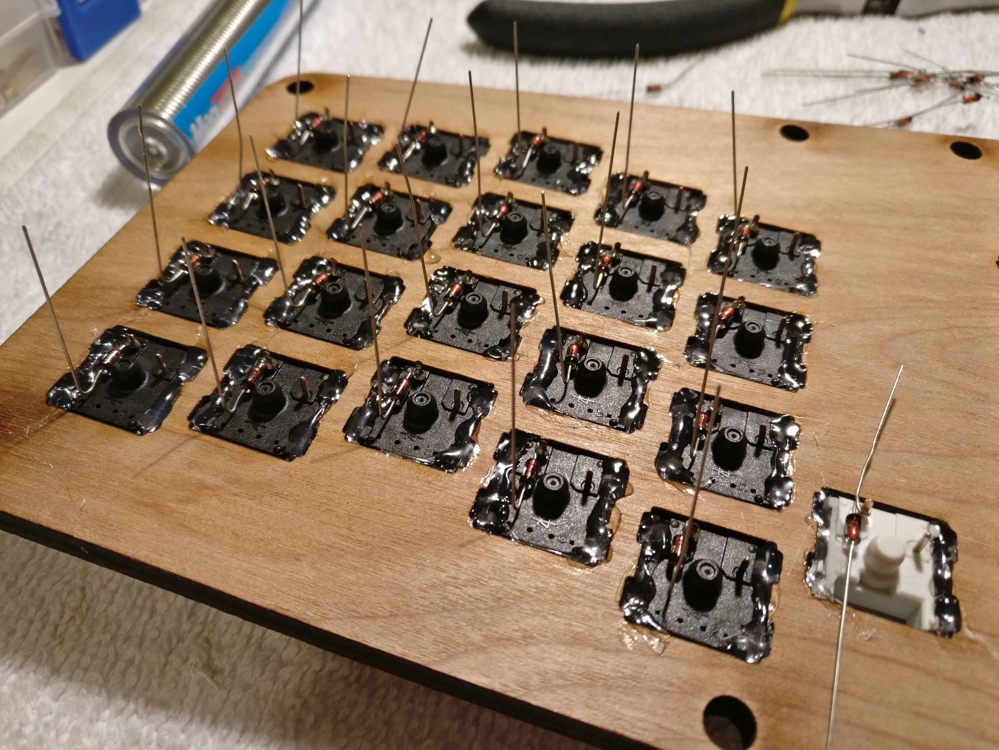

I recently finished my first handwired Atreus keyboard, an ortholinear keyboard with 42 keys. I'm really happy with how it turned out and I'm just documenting how it went for me, as well as some reference for my future builds. I'm proud of how it turned out and excited to do another soon! 

### Final product

This is a cross-section of both top and bottom of the keyboard. The bottom is clear acrylic so I can show off my handiwork! 

I researched the hell out of this thing before starting, because I practically knew nothing about the circuitry of how a keyboard matrix worked. The biggest hurdle was knowing the software well enough to enable the hardware. I was lucky in that the [Atreus hand wire guide](https://atreus.technomancy.us/assembly-hand-wired.pdf) is pretty comprehensive, as well as relying on great resources like this ["Modern handwiring guide"](https://imgur.com/a/qcgdF). I already knew a fair amount about pro micros from previous builds (I've built 4 other keyboards but with PCBs) so that gave me lots of information about its limitations and where stuff goes; as well as with experience with [QMK](https://github.com/qmk/qmk_firmware). There are plenty of awesome and active people on the QMK Gitter if you get stuck with the firmware. I also had plenty of help from the great people in the [UTMK discord](https://discord.gg/tjjT8J) (which welcomes anyone really) regarding the hardware aspect of my build.

### Build in review

The case is laser cut from &frac14;" plywood. A friend sold it to me after finding that it wouldn't work for his Atreus PCB. Here I'm putting in the switches; the black ones are Gateron Clears, the whites are Kalih Pro Purples.

Hot glued the switches in. If I could go back, I would have added the keycaps to the switches so that I could rotate them to better rotate/align them with one another before gluing them down. Lesson learned.

Diodes all added. Many guides recommend using loops so I did. This technique works *really* well. In some other builds, the downward facing leg of the diode is simply bent and soldered to the adjacent diode; I instead connected them to a row wire (blue) which ends up looking much more polished in my opinion.

Close up of diodes. If you look closely, the diode on the white switch is reversed... didn't find this error until after everything else was all put together.

Single row wire just before soldering.

Row wires connected. Use solid core wire and things will be *much* easier for you. I used stranded wire from an ethernet cable, and had to redo them a couple of times since I cut through too many strands while trying to remove the insulation. I also developed my own technique with a v-notch wire stripper after a while, to be able to remove the insulation quickly without the inner strands. Just use solid core.

Next came the column wires. These were easier since they are shorter.

Close up of column wires. You can't tell from this picture, but the top-rightmost switch had a short. The wires were a little too taught so when I soldered the column wire the insulation between the two melted together and the wire cores touched. Just had to pull them away from each other and that was it. I ended up having 3 shorts total, all because of the same thing.

Final product! I had tried to "bend" the green row wires to make it look nicer and let me organize them together better but... didn't achieve the intended effect. Still like the way it turned out, especially for a first time build! Here you can see the speaker I've added too. This keyboard can make noise! Here's a video of it playing the Imperial March on startup: https://youtu.be/XQPiW4ZtcOY

I ended up setting it to play the Zelda Treasure chime on startup instead.

TL;DR of things I learned while attempting to add this audio feature: 

- Pin C6 or B5 has to be unused and can't be shared with any keys
- Setting B5 in the firmware never seemed to work for me, so I freed up C6 instead, soldered the speaker to that, and everything was good 
- Enabling audio ends up taking a fair chunk of memory; you may need to disable other QMK features or you might brick the controller (which I believe I actually did on another keyboard)
- The novelty factor was worth it. My kid loves playing with it in music mode, and my coworkers have fun with it too.

My custom layout can be found on my [Keyboard Layouts repo](https://github.com/filoxo/keyboard-layouts). 

Top view of the keyboard with keycaps. The next steps will probably disassemble to to stain/treat the wood before using heavily, as well as add a strip of LEDs for some underglow.

