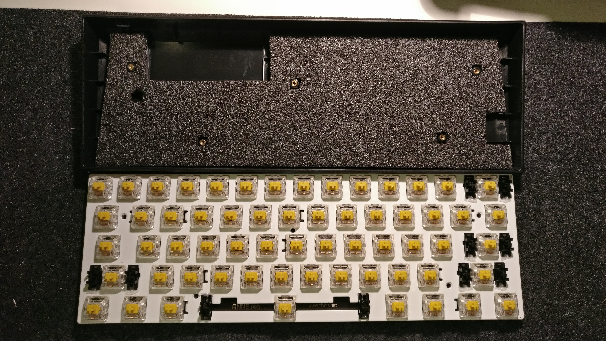
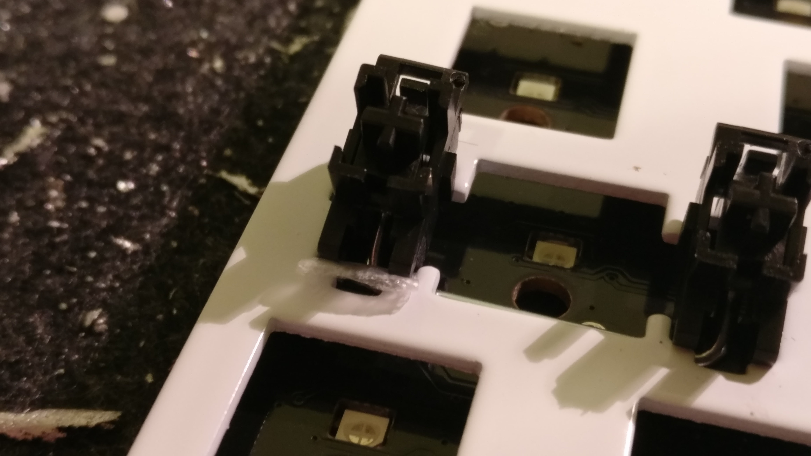
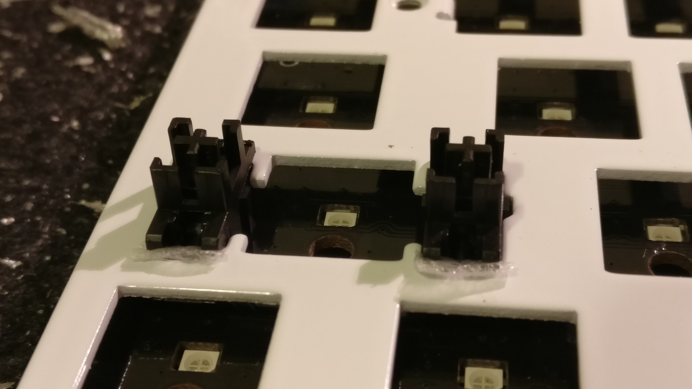

I recently started a new job and was able to request a new keyboard. I got the Anne Pro with Gateron Red switches, and have mostly liked it. I still felt like there were some improvements to be made, so I took a stab at it.

### Foam mod

I noticed that the plastic case is pretty loud when bottoming out. It wasn't too bad but I'm a fan of silent keyboards at work. 

I was able to get some &frac14;" foam padding from a friend, and cut it up to the dimensions of the case bottom. This was pretty straightforward, just cut the holes for the case screws and the reset button. This reduces the thunk and deepens the tone of the keys being pressed. 

### Replaced switches

As seen above, I replaced the default Gateron Red switches with some modified Kailh Heavy Dark Yellow switches that I purchased from r/mechmarket for cheaper than retail. 40 of these switches were lubricated and had a 80g springs, the rest were factory stock 70g. 

Surprisingly, I'm enjoying the heavier switches because they're harder to bottom out. My hands do get more tired after typing for a long time, but I don't write much and even typing this post hasn't fatigued my hands. 

Together with the foam mod, the switches sound like a bit like flat stones touching. I love it now!

### Clipped and stuffed stabilizers

Most of the rattle noise is due to the stabilizers. While the switches were removed I took apart the stabs. I clipped them to reduce the amount of parts that touch, and "stuffed" them with thin foam padding to reduce the movement even more (instead of using the more common ["band-aid" mod](https://imgur.com/gallery/6jtYB)). They are now much quieter and help me keep my sanity! I wondered if stabilizer grease would help the movement and might try that in the future. 

### Additional modifications

There are a few additional modifications I'll be adding in the future: 

- [installing a dedicated hardware switch](https://www.reddit.com/r/MechanicalKeyboards/comments/5pwpws/i_was_tired_of_not_being_able_to_fully_turn_off/)
- [adding a battery indicator](https://www.reddit.com/r/AnnePro/comments/6hgxne/i_added_a_power_switch_and_a_battery_indicator_to/)
- [changing the Anne Pro firmware](https://github.com/ah-/anne-key)
