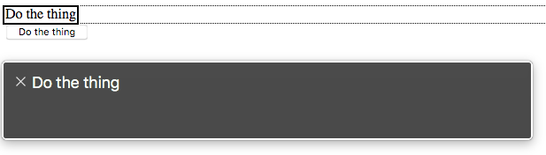
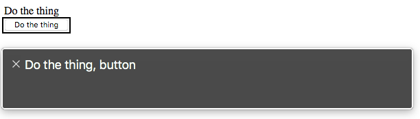

It's 2019 and I still see new code being written which uses non-interactive elements as buttons. Let's rehash why this is a problem. Take this example code of a `div` that has a click handler bound to it: 

```html
<div class="myBtn">Do the thing</div>

<script>
  const handleClick = (e) => {
    console.log('myBtn clicked')
  }
  const myBtn = document.querySelector('.myBtn')
  myBtn.addEventListener('click', handleClick)
</script>
```

<small>Don't get hung up on how the event is being bound; the principles would be the same if you were using jQuery, React, etc.</small>


### Keyboard Accessibility pt 1: Focus

One problem with this non-button is that it cannot receive focus, and therefore cannot be navigated to with a keyboard. This means that there is no way to trigger it without using a mouse and clicking on the element. This can be done with the `tabindex` attribute. Setting this attribute to `0` adds the element to the document tab order.  

```html
<div class="myBtn" tabindex="0">Do the thing</div>
```

Now you can tab to this element with your keyboard, and see the keyboard outline when focused on it. 

**HTML buttons are focusable by default.**

### Keyboard Accessibility pt 2: Events

Focusing on an element is only half of the keyboard navigation story. The element should also respond to <kbd>Enter</kbd> or <kbd>Space</kbd> key presses to trigger the same `'click'` event.

```html {7-13}
<div class="myBtn" tabindex="0">Do the thing</div>

<script>
  const handleClick = (e) => {
    console.log('myBtn clicked')
  }
  const handleKeyboardClick = (fn) => {
    return (e) => {
      if(e.key === 'Enter' || e.key === ' ') {
        return fn(e)
      }
    }
  }
  const myBtn = document.querySelector('.myBtn')
  myBtn.addEventListener('click', handleClick)
  myBtn.addEventListener('keydown', handleKeyboardClick(handleClick))
</script>
```

The `handleKeyboardClick` function above is a [curried function](https://www.sitepoint.com/currying-in-functional-javascript/) which accepts a function as a parameter (`fn`), and returns a function that will only allow executing that `fn` only if the key pressed is `'Enter'` or `' '` (Space). Using a helper like this allows us to reuse the same handler function for the click event but with the expected keyboard behavior.

**HTML buttons handle keyboard click events for free.**

### Semantic HTML & ARIA

Now that we can reach the element with a keyboard, let's switch to using another assistive device: a screenreader. A screenreader allows a non-visual user to be able to navigate and read the page content. So what happens when such a user navigates to this non-button? 



Let's compare this with an actual button.



It shouldn't be any surprise that a div semantically ["does not ... represent anything"](https://developer.mozilla.org/en-US/docs/Web/HTML/Element/div). It should also be noted that the CSS class name that we're using to select this element offers nothing for assistive tech to identify.

We can fix this by adding the correct aria-role attribute. If you haven't yet read through the <a class="link" href="https://www.w3.org/TR/wai-aria-practices-1.1/">WAI-ARIA Authoring Practices</a> it is time you did. It outlines the following:

- If this control is a *push button*, it needs a `role="button"` to designate it as an interactive button
- if this control is a *toggle button*, it needs `role="button"` and `aria-pressed` attributes, and `aria-pressed` is updated to reflect the current state of the control

```html
<div class="myBtn" tabindex="0" role="button">Do the thing</div>
<!--- OR --->
<div class="myBtn" tabindex="0" role="button" aria-pressed="false">Toggle the thing</div>

<script>
  const handleClick = (e) => {
    console.log('myBtn clicked')
    // Update aria-pressed for toggle buttons
    if(e.target.hasAttribute('aria-pressed')) {
      const pressed = e.target.getAttribute('aria-pressed') === 'true'
      e.target.setAttribute('aria-pressed', pressed)
    }
  }
  const handleKeyboardClick = (fn) => {
    return (e) => {
      if(e.key === 'Enter' || e.key === ' ') {
        return fn(e)
      }
    }
  }
  const myBtn = document.querySelector('.myBtn')
  myBtn.addEventListener('click', handleClick)
  myBtn.addEventListener('keydown', handleKeyboardClick(handleClick))
</script>
```

**An HTML button would only need the additional `aria-pressed` attribute.**

### And a few gotchas

For most use cases, you can actually use a button as a container; one such example is for a clickable card. It can contain an image and a heading and may display additional text when clicked. One possible limitation of this is that technically [only phrasing content is permitted within a button](https://developer.mozilla.org/en-US/docs/Web/HTML/Element/button) so no divs or other block-level elements and no other interactive elements (no buttons or anchors inside buttons, duh) can be children. The gotcha here is that when I tested that in current versions of Chrome, Firefox, and Safari, none of them failed to render the div inside the button. Kind of weird, so shy away from it if you can.

Also, [the default button type is "submit"](https://developer.mozilla.org/en-US/docs/Web/HTML/Element/button#attr-type) so when creating something like a reusable toggle button component using any modern framework, keep this in mind. If your component may be rendered inside a form and does not have a default set to something other than "submit", it may trigger a submit.

And lastly, **[just](https://developer.paciellogroup.com/blog/2011/04/html5-accessibility-chops-just-use-a-button/) [use a](https://www.youtube.com/watch?v=CZGqnp06DnI) [button](https://formidable.com/blog/2014/05/08/anchors-buttons-and-accessibility/)**.