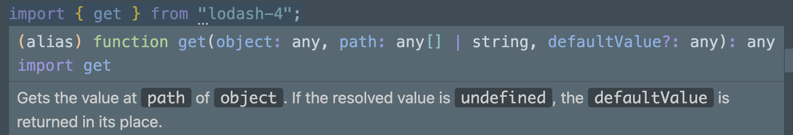

This post is inspired by a question someone asked in the single-spa Slack:

> I saw import-map syntax I've never seen before and I was wondering if single-spa (really more SystemJS) supported it.

> ```json
> <script type="importmap">
>   {
>     "imports": {
>       "lodash@3/": "https://unpkg.com/lodash-es@3.10.1/",
>       "lodash@4/": "https://unpkg.com/lodash-es@4.17.21/"
>     }
>   }
> </script>
> ```
>
> So like how would that import statement have to look? If it's the following then I don't see how tyypescript would compile (not at my desk to check):
>
>     import _ from “lodash@4”
>
> I suppose it wouldn't be a sync import and maybe that's the deal. It would have to be:
>
>     // I hope there is a webpack plugin or something that can append the version so that we don't have mismatches of library versions
>     const _ = await SystemJS.import(“lodash@4”)
>
> Note I saw this in this excellent article thanks to JSWeekly https://www.honeybadger.io/blog/import-maps/

I think this is a fun topic to delve into a little! So first let's look at the import map.

```json
<script type="importmap">
  {
    "imports": {
      "lodash@3/": "https://unpkg.com/lodash-es@3.10.1/",
      "lodash@4/": "https://unpkg.com/lodash-es@4.17.21/"
    }
  }
</script>
```

The keys under `imports` that can be used by the importing application is called a <dfn>module specifier</dfn>. I've also taken to calling this a <dfn>bare specifier</dfn> because it looks more reminiscent of a locally installed module and not a fully qualified URL. It stood out me the [the import maps spec](https://wicg.github.io/import-maps/#:~:text=that%20specifier%20was%20a-,bare%20specifier,-%2C%20but%20was%20not) but I'm unsure whether that is used or understood generally.

The next thing to consider is the specifier string itself. Import map specifiers do not have the same [naming requirements](https://wicg.github.io/import-maps/#normalize-a-specifier-key) as [npm's naming rules](https://www.npmjs.com/package/validate-npm-package-name#naming-rules) so there seems to be a gap in the spec here with regards to the allowed naming that could lead to confusion or problems down the line. You can use a specifier like `lodash@4` if your code will not require a build step or interop with node at all, <strong>but</strong> if you need to use local tooling (such as TypeScript) you'll need to follow npm's naming rules by using `lodash-4` or similar. Exactly why will be explained later.

Next, that specifier also looks a little different because it contains the version appended to it. And even the trailing slash is signficant because it denotes a [package folder mapping](https://github.com/systemjs/systemjs/blob/main/docs/import-maps.md#imports), which means that anything after that will simply be appended to it as part of the request to load the module.

To use these in your JavaScript, you import it like you would any other module.

```js
import { get } from 'lodash-4/get';
```

<Aside>

At this point, if you don't want this dependency included in your application and you use a bundler you'd also need additional configuration for [externals](https://webpack.js.org/configuration/externals/).

</Aside>

This allows for the module to be resolved at runtime! But without having this code locally you would lose things like IDE autocomplete or tooling interop. The simplest solution here would be to install the package locally as an alias.

```shell
npm i lodash-4@4@npm:lodash-es@4.17.21
# pnpm add lodash-4@npm:lodash-es@4.17.21
```

This will allow access to local node_modules, nice! Tht enables IDE autocomplete and interop with most of your JavaScript tooling.



Surpringly this also works with TypeScript out of the box too! I tested this with React 17 and TypeScript was still able to show me the correct typings.
